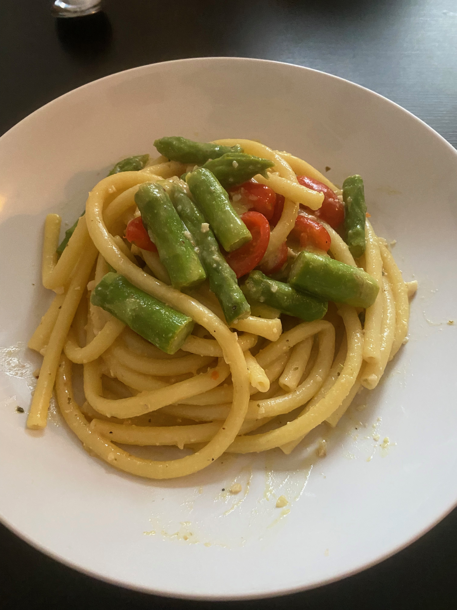

# Zitronen-Parmesan-Paste mit grünem Spargel

**Zutaten:**
- 1 Knoblauchzehe
- 1 EL Olivenöl
- 250ml Gemüsebrühe
- 1/2 Bio-Zitrone
- ca. 500g grüner Spargel
- 250g Nudeln (Penne)
- 50g Cashew Nüsse
- Hefeflocken
- Eiersatz
- Salz/Pfeffer

### Anleitung
- Spargel waschen, die holzigen Enden abschneiden und in mundgerechte Stücke schneiden.
- Knoblauch schälen und fein hacken.
- Gemüsebrühe in Wasser lösen und Zitronenschale abreiben und anschließend auspressen.
- Nudelwasser aufsetzen.
- Öl in Pfanne erhitzen und Knoblauch für 2 Minuten anbraten.
- Knoblauch mit Gemüsebrühe und Zitronensaft ablöschen und für 10 Minuten auf mittlerer Hitze kochen lassen.
- Nudeln ins Wasser legen.
- Eiersatz für 1 Ei vorbereiten
- Cashew Nüsse in Mörser oder Mixer zerkleinern. Hefeflocken und etwas Salz hinzufügen und alles gut vermischen.
- 3 Minuten vor Ende der Nudeln Spargel hinzugeben und 3 Minuten mit kochen.
- Cashew-Hefeflocken-mischung, Zitronenschalen und Ei in die Zitronensauce geben und durchrühren.
- Nudeln und Spargel abgießen und zur Sauce hinzugeben und unter niedriger Hitze vermischen und mit Salz und Pfeffer abschmecken.

